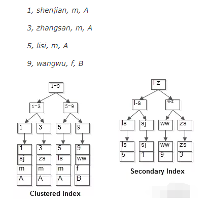

* content
{:toc}


# 回表查询是啥?
我们小学二年级就学过(by毕导)的索引内容,InnoDB中主要有B+Tree索引,哈希索引,还有全文索引

其中 B+Tree索引又分为聚集聚集(clustered index)和普通索引(secondary index)

## 聚集索引 Clustered Index
InnoDB存储方式中,行数据存储在聚集索引的叶子节点中.

因此InnoDB必须要有,并且只能有一个聚集索引
* 如果表中定义了主键,那主键就是聚集索引
* 如果表中没有定义主键,那么第一个not null unique列是聚集索引
* 否则InnoDB会创建一个隐藏的row-id作为聚集索引

## 普通索引 Secondary Index
InnoDB中的普通索引的叶子节点存储着主键值(聚集索引)

使用普通索引查询过程为
* 首先通过查询普通索引得到主键值
* 再通过聚集索引定位到行记录

这种在MySQL内部经历了两次查询才得到结果的查询方式,称为回表查询(也叫二次查询)


图为两种索引方式存储的叶子节点



# 如何避免回表查询?
将被查询的字段,建立到联合索引中
如果上图中 id为聚集索引,name为普通索引
```SQL
select id,name from users where name='zhangsan';
```
通过普通索引name,能直接拿到要查询的所有字段(id和name);

但是
```SQL
select id,name,sex from users where name='zhangsan';
```
通过普通索引并不能得到sex字段,需要回表查询才能取出

把单列索引(name)改为联合索引(name,sex) 就能命中索引,不需回表查询.


但是 **联合索引的建立需要进行仔细分析**,需要考虑
* 联合索引的几个字段是否经常 **同时** 出现在where子句中
* 如果几乎没有单字段查询,可以考虑添加联合索引
* 如果既有几个字段的单列索引,又有联合索引,一般可以删除联合索引
* 当联合索引字段超过3个时,要考虑是否有该必要.
*******

但索引并不是越多越好,建立索引会有
* 额外的索引开销
* 数据变更需要更新索引,额外的维护成本
* 额外的存储索引的空间
需要权衡好二者之间的关系